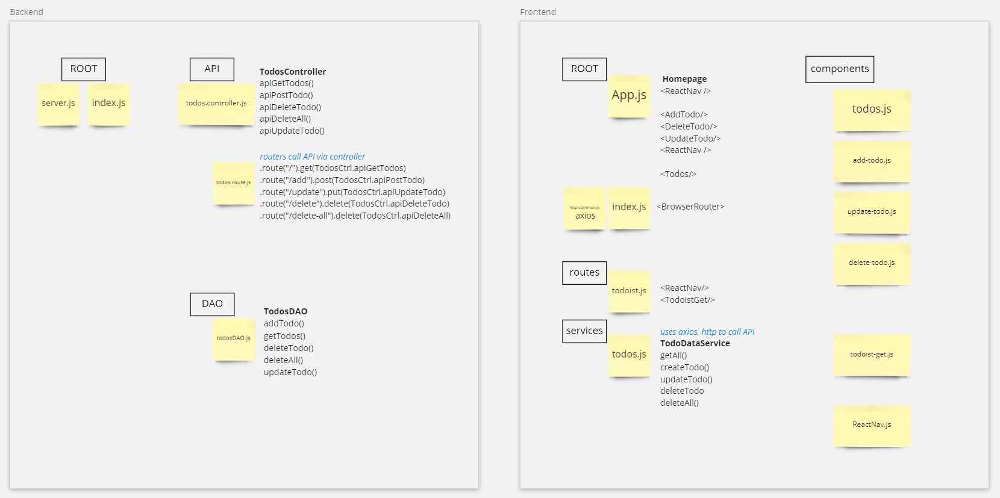

# Layout

# Rubric
- Video - 5
	- description
	- terminal
		- backend
		- frontend
	- app run through (with POSTMAN API)
		- todoist
			- get todoist
			- add to database
		- homepage
			- show todos
			- delete all
			- add todo
			- delete todo
			- update todo	
	- code
		- backend
			- route
			- DAO
			- API
		- frontend
			- App
			- components
			- routes
			- services
			- http-common
- Data Form - 3
	- Create - frontend\src\components\add-todo.js
	- Update - frontend\src\components\update-todo.js
	- Delete - frontend\src\components\delete-todo.js
	- Todoist - frontend\src\components\todoist-get.js
- Bootstrap - 3
	- nav - frontend\src\components\nav.js
	- forms - frontend\src\components\, frontend\src\components\todoist-get.js
	- todos - frontend\src\components\todos.js, frontend\src\components\todoist-get.js
- CRUD - 8
	- Create - frontend\src\components\add-todo.js
	- Read   - frontend\src\components\todos.js
	- Update - frontend\src\components\update-todo.js
	- Delete - frontend\src\components\delete-todo.js, frontend\src\components\todos.js
- API x2 - 2
	- todoist - frontend\src\components\todoist-get.js
	- app itself - backend\api\todos.controller.js
- AJAX - 2
	- loading todoist - frontend\src\components\todoist-get.js
	- homepage on load, navigate to, and "Get Todos | Refresh List" Button
	- [ ] homepage Create, Update, Delete
		- added these as separate components
		- didn't have time to figure out how to pass the function/state to them
			- https://reactjs.org/docs/faq-functions.html
			- https://www.robinwieruch.de/react-hooks-fetch-data/
			- https://www.pluralsight.com/guides/how-to-reference-a-function-in-another-component
			- useState, useEffect, props
- Usability - 2
- Quality of source code - 2
- On Time Submission - 3

# Notes
backend - `nodemon server`

frontend - `npm start`

## API
backend\api\
frontend\src\services\todos.js
### CREATE
post
http://localhost:5000/api/v1/todos/add
```
{
	"name": "READ: This thing",
	"priority": "2",
	"description": "From website 123, recommended by Dude"
}
```
### READ
get
http://localhost:5000/api/v1/todos
### UPDATE
put
http://localhost:5000/api/v1/todos/update

`http://localhost:5000/api/v1/todos/update?id=63029c1da993c894798e4d23&p=5`
### DELETE
delete
http://localhost:5000/api/v1/todos
```
{
	"id": "63029c1da993c894798e4d23"
}
```
delete
http://localhost:5000/api/v1/todos/delete-all